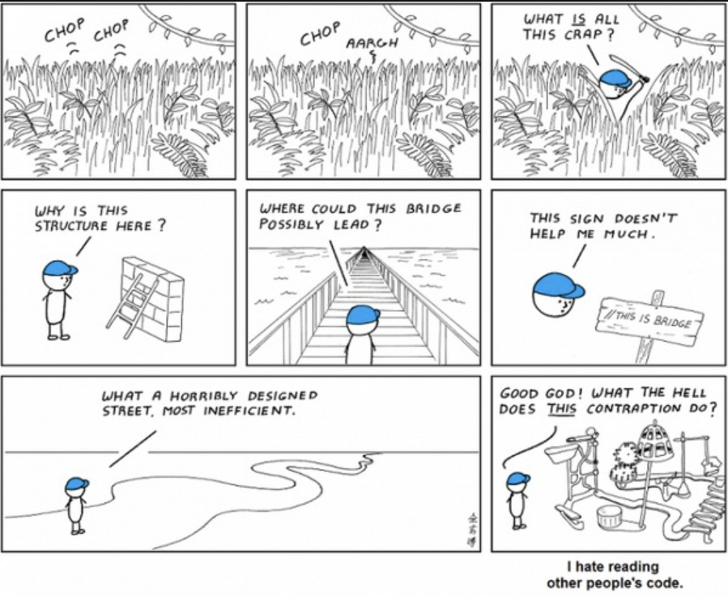
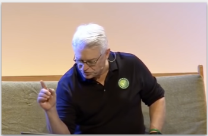
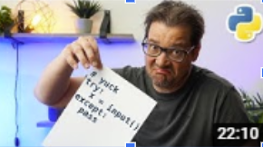

# Clean Code

People who write code are often not the same people who maintain it. Trying to understand an unfamiliar codebase to fix a bug in production is already stressful enough, but trying to understand _badly written_ code is even worse.

  

Code is read more often than it is written, so we should always write our code thinking about the person who will eventually read it - even when that person turns out to be you. Being able to return to previously written code and understand what it does is key, especially in the software development world.

This module focuses on the principles of clean code, and how to apply them to your own code.

## Uncle Bob - Clean code lesson 1 (1:48)

[Link to video](https://www.youtube.com/watch?v=7EmboKQH8lM)

Robert "Uncle Bob" Martin is one of the icons of the industry and one of the authors of the Agile Manifesto. In this first part of the "Coding Better World Together", he explain what is clean code, why it matters, and establishes the bases to achieve it.

After this lesson you should:

- Understand what clean code is,
- Learn how to start refactoring your current codebase,
- Antipatterns to avoid.

## 7 Python Code Smells (0:22)

[Link to video](https://www.youtube.com/watch?v=LrtnLEkOwFE)

This video shows 7 code smells that point to poor design decisions, as well as how to fix them. It's a very practical video, that uses actual Python code and a good way to close this module.

After this lesson you should:

- Have a better idea of things to look out for when reviewing other people' codes. But we will cover more ground in the following modules.
