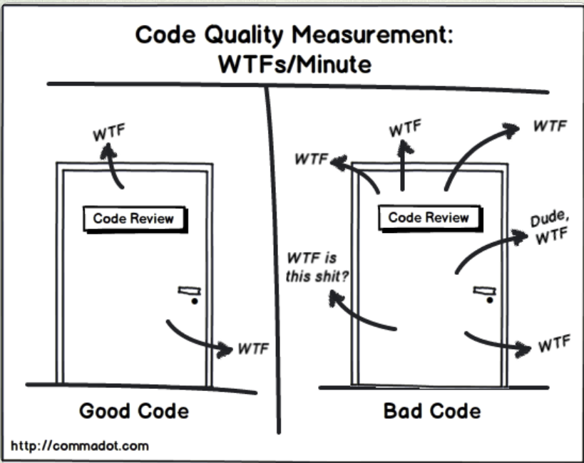
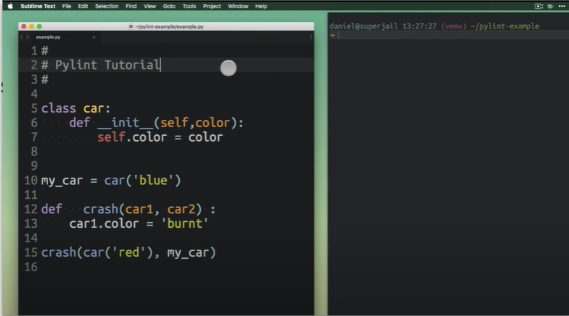

# Linting

How can one measure "code quality"?



Well... close!

Fortunately for use, there are tools that can help us locate code smells (remember those) and measure code quality. These tools are called linters. Though there are many linters out there, we will focus on `pylint`.

## Pylint Tutorial (0:17)

  

[Link to video](https://youtu.be/fFY5103p5-c)

After this lesson you should:

- Know how to install and set up the Pylint code linter,
- Know the pros and cons of `pylint`.

## Pylint Configuration

For the assignment, you may need to configure `pylint` to ignore some errors. Pylint is highly configurable. There are a lot of options to follow the needs of various projects and a lot of checks to activate if they suit your style.

You can generate a sample configuration file with `--generate-toml-config` or `--generate-rcfile`. Every option present on the command line before this will be included in the file. In practice, it is often better to use a minimal configuration file which only contains configuration overrides. For all other options, Pylint will use its default values.

Because the assignment already uses the `pyproject.toml` file, you will use that to configure `pylint`. A suggestion on how to configure that is as follows:

1. Generate a sample configuration file with `pylint --generate-toml-config > delete_this.toml`. If you get the error `pylint: error: no such option: --generate-toml-config`, ensure you have the latest version of `pylint` installed.
2. This configuration file contains a lot of options. Everything that's not commented is currently active. Imagine, for example, that you want to disable the `missing-module-docstring` check. This is done by the `disable` option. So that's the option you need to add to the `pyproject.toml` file.
3. Besides the option itself, you also need to know the option header. In this case it's `[tool.pylint."messages control"]`. The header is the part between `[` and `]` before each group of options.
4. So, in the `pyproject.toml` file, add the following lines:

   ```toml
   [tool.pylint."messages control"]
   disable = [
      "missing-module-docstring",
      # Add any other checks you want to disable here
   ]
   ```

5. Finally, you can delete the `delete_this.toml` file and `pylint` will use the configuration in the `pyproject.toml` file.

Remember you can always refer to [Pylint user guide](https://pylint.pycqa.org/en/latest/user_guide/checkers/features.html) so see all the checks that are available.
