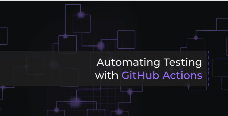

# Continuous Integration (0:05)

  

[Link to Coursera lecture](https://www.coursera.org/lecture/web-app-command-line-tools-for-data-engineering-duke/automating-testing-with-github-actions-xzXZY)

In this lesson from Duke University on GitHub Actions, you will learn how to create of a testing workflow using a template starter.

---

## Assignment #1

Now that you have learned how clean code is, how to refactor your code, how to lint it, and how to setup a CI pipeline to your project, it's time for the Assignment #1!

### Assignment #1 covers

- A data manipulation task,
- Linting a project
- Adding command-line options
- Creating a CI pipeline

Open your assignments project and good luck! 👍
