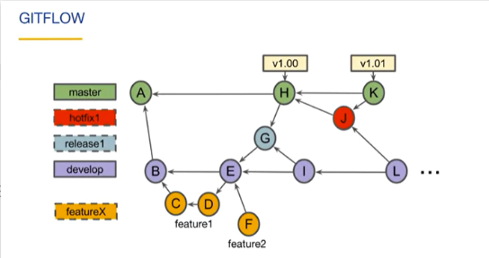
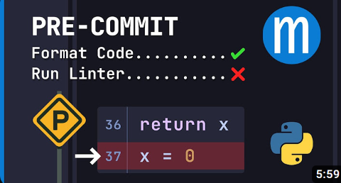

# Git strategies (0:12)

[Link to Coursera lecture](https://www.coursera.org/lecture/version-control-with-git/git-workflows-JdGxA)

Git is very flexible and can be tailored to many types of projects and teams. This lecture introduces 4 common workflows so you don't reinvent the wheel. This course is good for people who know Git but are not in the habit of using it in a group context - i.e. know just enough Git to be dangerous

After this lesson you should:

- Know four strategies for working with Git with your team in a more seamless fashion.

## Pre-commit (0:06)

Now you finished the previous assignment, this situation should sound familiar to you: you've added new code, committed it, and pushed it to GitHub. You're ready to open a pull request, but you forgot to run the linter beforehand the CI threw an error. What if you could catch those errors before you even commit your code? That's what pre-commit is for!

Now that you have finished the previous assignment, here's a situation that could sound familiar to you: you've added new code, committed it, and pushed it to GitHub. You're ready to open a pull request, but you forgot to run the linter beforehand the CI threw an error. What if you could catch those errors before you even commit your code? That's what pre-commit is for!

[Link to lesson](https://www.youtube.com/watch?v=psjz6rwzMdk)

Most linters have instructions on how to integrate them with `pre-commit`. For example, here are the instructions for [pylint](https://pylint.pycqa.org/en/latest/user_guide/installation/pre-commit-integration.html).

Feeling up to a challenge? Why not try to add `pre-commit` to your project?
