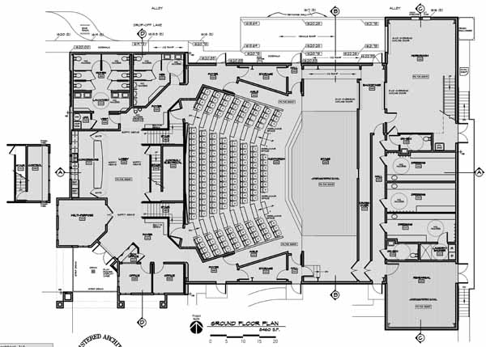
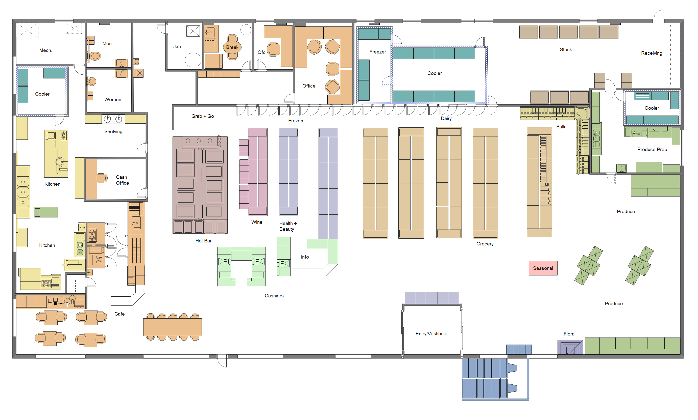

# Project Structure

## What is software design

The goal of software architecture is to minimize the human resource required to build and maintain software systems. If the effort required to maintain a system grows with time, then the design is bad. If it's constant or shrinks with time, then the design is good!

The key is to never sacrifice good design for speed, because this creates a mess that will force you to go slow in the long term. Technical debt and a swampy code base are a bane of all bigger software projects.

Even if you think "Oh, I will just hack this together and then I will refactor it later", you are wrong. **You will never have time to refactor it later**. You will just keep adding more and more hacks until the system becomes unmaintainable.

As a developer you will often have to choose between creating new features (behavior value) and maintaining proper structure and architecture of code (structure value).

Obviously stakeholders would love for new features to be applied almost instantaneously, without wasting time for some design-mumbo-jumbo which they neither understand nor care about. As a developer, it's your role to create the pressure for maintain standards of code care.

The reason is this: if you create a system that works perfectly, but nobody can easily change it, then as soon as the requirements change (and they will change), that software will become worthless. But create a software that does not work, but it's changeable, you can make it work.

The structure value ensures that our project will be profitable long into the future.

## Project structure (0h15)

The structure of a project is the way in which the code is organized. It's the way in which the code is split into files and directories.

It's impossible to achieve good software design without a good project structure. The project structure is the foundation of the software design.

### Scope vs Shape

Stakeholders believe that requirements and changes are complicated by their **scope**. For example, imagine they want to add a new rule to how a model feature is calculated. Because the rule itself is simple, they believe that the change is simple.

But programmers see each new requirement as a new puzzle piece that must be fit into an every more complex puzzle. That puzzle is the **shape**.

> In a bad architecture, a small change for the stakeholder is an expensive change for the developer because it would cause massive repercussions through the system.

In our example, the new rule would require changes in many places in the code that could cause other features to break.

So here are some rules of thumb for project structure:

### 1. Make things easy to understand

Imagine the floor plans of a building. The floor plans shows the shape of the building and you can easily surmise the purpose of a building just by looking at the floor plans.

Can you guess what these buildings are?

The first one is a movie theatre and the second one is a grocery store. You can probably tell that just by looking at the floor plans. The same should apply to your code. The shape of the code should tell you the intent of the code.

For example, if is a data science project, I would expect to see folders for data, notebooks, training models and reports. If it's a web application, I would expect to see folders for templates, static files, and middleware.

Take a moment to look at the project you are working on. Can you tell what it does just by looking at the names of the scripts and folders?

### 2. Make things easy to find

Imagine you're in your sprint planning. You've been tasked with fixing a bug. "It's a simple bug", the senior developer says. "All you have to do is change the `calculate_date` function".

But where is that? You look at the code and you can't find it. You ask the senior developer and he says "It's in the `utils` folder". But there are 20 files in the `utils` folder. Which one is it?

The problem about a folder with a name such as `utils` is that it's too generic and they don't add any semantic meaning to the functions and classes. It's a dumping ground for code that doesn't fit anywhere else. It's okay if you keep them small, but be careful with folders with generic names like `utils`, `functions`, `helper` and `common`: they can quickly become a black hole.

Another problem is the depth of nested folders. The closer a function is to the surface, the easier it is to find. So keep the most important functions and classes close to the surface. That why, in `pandas` you can import the `read_csv` function directly from the `pandas` module. Imagine if you had to import it from `pandas.io.parsers.read_csv`!

### 3. Make things modular

Remember when we said programmers see each new requirement as a new puzzle piece that they must be fit into a puzzle that grow more and more complex?

The solution is to make the puzzle pieces interchangeable. If your puzzle is make only of square pieces, then you can easily swap them around. But if your puzzle is made of pieces of different shapes, then it's considerable harder.

The same applies to your code. If you can swap parts of your code with ease, then your code is modular.

A good strategy is to make your code modular is to think about it as LEGO blocks. Each block should be self-contained and have a single responsibility. Then you have an "entrypoint" (i.e. the main script) that connects the blocks together.

#### What is a "responsibility"?

A responsibility is a reason to change.

As an example, consider a function/module/class that compiles and prints a report. This piece of code can be changed for two reasons:

1. The content of the report could change.
2. The format of the report could change.

That means that it currently contain two responsibilities. Because they are together, they may share some state or variables - this means the responsibilities are **coupled** by this shared state.

In our puzzle metaphor, two coupled components are like two puzzle pieces with tabs so unique that can only connect with each other,

Imagine this scenario:  you need to change the order of the report section;  but that caused a variable that was also being used to create the content to change therefore breaking how the content was created.

## References for project structure

Now that we know what is a good project structure, let's see some references to inspire us. Note how you can easily tell what the project does just by looking at the project structure.

### Cookiecutter Data Science (0h15)

[Link to Cookiecutter Data Science](https://drivendata.github.io/cookiecutter-data-science/)

The Cookiecutter Data Science project is a template for data science projects. It's a good starting point for many projects. It's opinionated, but all its opinions are justified.

After this lesson you should:

- Have a reference on how to layout projects involving data flows.

### Python application layouts (0h15)

[Link to RealPython guide](https://realpython.com/python-application-layouts/)

This is an useful reference guide for Python application layouts. Although it's not a tutorial, it's a good piece to keep for future reference.

Note that the guide is from 2018, so we still see references of files that are now (in 2022) being replaced by the[`pyproject.toml` configuration file](./../01_clean_code/1_long_code_is_not_good_code/2_pyproject.md) (which replaces the `requirements.txt`, `MANIFEST.in` and `setup.py` files)

After this lesson you should:

- How to design command line applications,
- How to recognize web applications frameworks.
