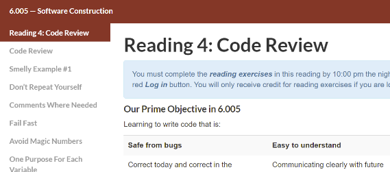

# MIT's Smelly Examples (0:30)

[Lint to MIT's course](https://web.mit.edu/6.005/www/fa15/classes/04-code-review/)

This lesson provides examples of quality criteria and code smells (I told you we were going to talk more about then, didn't I?). It also have exercises, which are always nice. Be sure to click "explain" on the available answers to see why they are good or bad.

After this lesson you should:

- Know how give feedback in a code review,
- Know what to look for in a code review.
