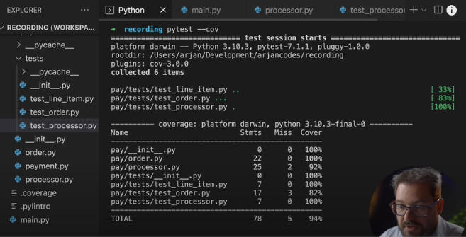

# Testing

## How to write unit tests for existing Python code (0:42)

  

- Part 1 - [Link to YouTube video](https://youtu.be/ULxMQ57engo)
- Part 2 - [Link to YouTube video](https://youtu.be/NI5IGAim8XU)

This 45min video covers a practical example of adding unit tests to existing code, followed by a refactoring of the code. It's a great example of how to use tests to refactor code. You will get a sense on how refactoring can simplify test while improving the design.

After this lesson you should:

- Learn the criteria to use when selecting what piece of code to test first,
- Learn how to use the `pytest` framework,
- Know about `mock` objects, and how to use `pytest-monkeypatch`,
- See an example of dependency injection to make code more testable.

> **Note**: The author shows a `coverage` report. The package `pytest-cov` is a `pytest` plugin that generates coverage reports by adding the option `--cov` to your testing command.

## Testing DataFrames (0:10)

[Link to Testing DataFrames tutorial](testing_dataframes.md)

Testing data is a little bit different than testing regular Python code. In this lesson, you will learn how to test Pandas and Pyspark DataFrames.

After this lesson you should:

- Know how to test Pandas DataFrames with the `pandas.testing` module,
- Know how to test Pyspark DataFrames with local spark sessions.

## What should you test?

Potentially one can test _everything_. However, this is not practical - nor desirable. The goal of testing is to ensure that the code is working as expected. This means that you should test the code that is critical to the application. For example, if you are building a web application, you should test the code that handles the HTTP requests. If you are building a data pipeline, you should test the code that handles the data transformations.

There are 2 things you should always have:

1. You should have an integration test that runs the entire application. This is to ensure that the application is working as expected when all the pieces are put together. This is also called an end-to-end test.
2. You should have at least one unit test for each _public_ function. This is because public functions are the one that will be imported and used by other applications or modules.

What about the private functions? Those function that start with a `_` or a `__`? You don't really need to test those. The other problem with testing internal functions is that it increases the likelihood of your tests failing for the wrong reasons. For example, when changing something internal, that doesn't break anything but forces you to spend a long time updating all tests.

But what if the internal function is critical to the application? If you really believe a particular internal function should be tested, that's a strong indicator it should be decoupled. Move it to a module of its own and make that function public.

## Extra resources

These are optional, but hey can be useful if you want to learn more about testing.

- [Code coverage](coverage.md) - What is code coverage and how to use it with `pytest`.
