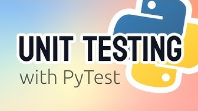
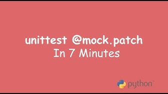

# Testing

## Introduction to Unit Testing with PyTest (0h35)

[Link to video](https://youtu.be/YbpKMIUjvK8)

This video is meant to be your first contact with Pytest. It will show you how to write unit tests for a simple shopping cart application..

- Unit tests are functions that check if your code or application works as intended.
- If the application works correctly, tests should pass. If there's a bug or improper implementation, tests should fail.
- Unit tests allows you to quickly detect problem when you are making changes to existing code. This is especially important when working in a team.
- Refactoring without unit tests can be risky.
- Unit tests ensure new functionality doesn't break existing code.

After this lesson you should know:

- The basics of Pytest: Understand the importance of unit tests, how to set up PyTest, and the conventions for writing and naming tests.
- How to write and run specific tests, including checking for exceptions.
- Some best practices: Like making sure tests fail for the right reasons, and get introduced to the concept of reducing duplicate code in tests with fixtures.

## What should you test?

Potentially one can test _everything_. However, this is not practical - nor desirable. The goal of testing is to ensure that the code is working as expected. This means that you should test the code that is critical to the application. For example, if you are building a web application, you should test the code that handles the HTTP requests. If you are building a data pipeline, you should test the code that handles the data transformations.

There are 2 things you should always have:

1. You should have an integration test that runs the entire application. This is to ensure that the application is working as expected when all the pieces are put together. This is also called an end-to-end test.
2. You should have at least one unit test for each _public_ function. This is because public functions are the one that will be imported and used by other applications or modules.

What about the private functions? Those function that start with a `_` or a `__`? You don't really need to test those. The other problem with testing internal functions is that it increases the likelihood of your tests failing for the wrong reasons. For example, when changing something internal, that doesn't break anything but forces you to spend a long time updating all tests.

But what if the internal function is critical to the application? If you really believe a particular internal function should be tested, that's a strong indicator it should be decoupled. Move it to a module of its own and make that function public.

## More on Mock objects

In the last video you were introduced by the concept of mock objects, where the author replaced a parameter with a mock object. However, that's not something we usually do. This is because we don't have access to the thing we want to mock most of the times.

For example, in your homework, you will have to test a function that uses pandas' `read_csv` function. The `read_csv` method is inside the function: you can't access it directly to replace it with a mock object. That's why you need to use the `patch` decorator.

A couple of warnings about the next video:

1. It uses the `python.unittest` framework instead of `pytest`. The concepts are the same, but the syntax is a little different. However, the important thing is that the way you use patches and mocks also work for pytest.
2. From the 3:30 to the 4:15 mark, the author talks about the "setups" and "teardowns. This is the only part that's specific to `unittest`. You can skip it.

[Link to video](https://youtu.be/_OyuFg9pGQg)

## Testing DataFrames (0h30)

[Link to Testing DataFrames tutorial](testing_dataframes.md)

Testing data is a little bit different than testing regular Python code. In this lesson, you will learn how to test Pandas and Pyspark DataFrames.

After this lesson you should:

- Know how to test Pandas DataFrames with the `pandas.testing` module,
- Know how to test Pyspark DataFrames with local spark sessions.

## Fixtures

Fixtures are the building blocks of Pytest, so it's important to understand how they work. Luckily, they are not that complicated and Pytest has a great "how to" tutorial on them.

Jump to their ["How to use fixtures"](https://docs.pytest.org/en/latest/how-to/fixtures.html) section and read until the "Dynamic scope" session. This should take you about 10 minutes and it covers the most important parts of fixtures. The rest of the page are more advanced use cases. You can skip them.

## Extra resources

These are optional, but they can be useful if you want to learn more about testing.

- [Code coverage](coverage.md) - What is code coverage and how to use it with `pytest`.
- [Pytest's `Monkeypatch`](https://docs.pytest.org/en/latest/how-to/monkeypatch.html) - Pytest's version of mock objects is called `Monkeypatch`. They work a little differently and are not as flexible as `unittest.mock`'s mock objects, but they are easier to use. We won't cover them here, but here's a nice - and official - resource on how to use them.

---

## Assignment #3

It's finally time for Assignment #3!

> **Note**: This assignment will require your code to be reviewed by your peers.

This assignment is about creating tests. It's not the more joyful of tasks - particularly for existing code - but it's oh so important.

### Assignment #3 covers

- Creating tests
- Creating test fixtures
- Mocking methods and objects

Open the `assignments` project, good luck and see you on the other side!
