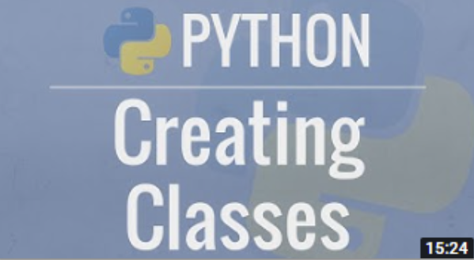
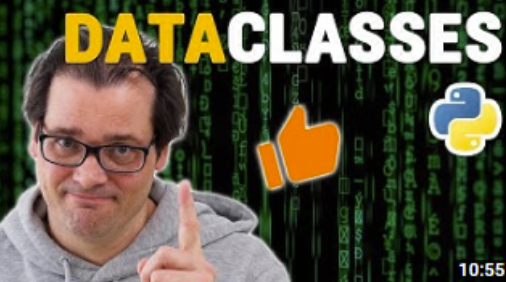
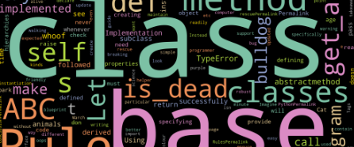
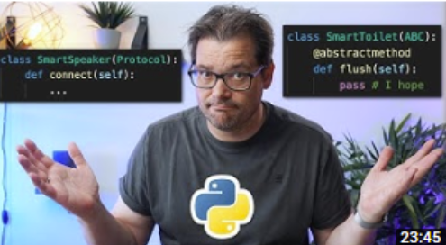

# Object-oriented programming

Classes and objects are the two main aspects of object-oriented programming.

It's not the easiest concept to grasp (specially when most explanations are in Java), but once you get it, you can't go back.

This chapter is a long one. It covers from the basics of classes and objects to more advanced concepts like inheritance and polymorphism. We also cover some special types of classes that can make the lives of Data Scientists and Data Engineers a lot easier.

## Python OOP Tutorial (1:20)

[Link to playlist](https://youtube.com/playlist?list=PL-osiE80TeTsqhIuOqKhwlXsIBIdSeYtc)

This is a comprehensive playlist (total time: 1:25) that covers a lot of ground when it comes to classes.

By the end of it, you should know about:

- Creating classes
- The `super()` method
- Class variables
- `classmethod` and `staticmethod` decorators
- Inheritance
- Property decorators
- Dunder methods

## Mixins (0:10)

[Link to article](https://dev.to/bikramjeetsingh/write-composable-reusable-python-classes-using-mixins-6lj)

Python features multiple inheritance, which means that a class can inherit from multiple classes. This article shows how you can use mixins to achieve that.

After this lesson you should have a grasp on how to create mixins that change the behavior of a class.

## `Dataclass` (0:10)

[Link to video](https://youtu.be/vRVVyl9uaZc)

This video is a tutorial about Python's dataclasses. It take  you through an example that shows what you can do with them. Python data classes are - as you'd expect - in particular suitable to model classes that represent data, and as such they offer easy mechanisms to initialize, print, order, sort and compare data.

## Enums (0:10)

[Link to guide](https://gamedevacademy.org/python-enum-tutorial/)

The Python enum module, a powerful tool for handling sets of data that don't change. It's also a great way to remove imprecise types from your code.

After this lesson you should:

- Understand what Python enums are,
- Know about special kinds of enums, like the `Flag` and the `IntEnum`.

## Abstract Base Class (ABC) (0:15)

[Link to article](https://dev.to/dollardhingra/understanding-the-abstract-base-class-in-python-k7h)

Abstract base classes are a way to define a set of methods that a child class must implement. They are a great way to define interfaces so that other programmers can follow to extend your code without breaking anything.

After this lesson you should:

- Know how to create an abstract base class,
- Understand the benefit of using an abstract base class.

## Protocols (0:23)

  

[Link to video](https://youtu.be/xvb5hGLoK0A)

Protocols are similar to abstract data classes. So when should you use a protocol class vs abstract base class? This video shows you an example where both can be used, discusses the trade-offs and gives you a suggestion of when to use each of them.

After this lesson you should:

- Know what Protocol classes are and when to use them.

---

## Assignment #4

This assignment is about OOP and VSCode shortcuts, make sure you have those in mind!

### Assignment #4 covers

- Enums
- Object composition
- Testing objects

Open your assignments project, and let's go!
