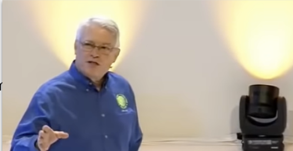

# Project Structure

## Clean code and project structure (1:20)

[Link to video](https://www.youtube.com/watch?v=sn0aFEMVTpA)

In the 5th lesson from Uncle Bob's Clean Code series, he talks about project structure and the importance of using it to convey the code's intent to the reader.

> **Note**: Unlike the two previous Uncle Bob videos in this learning path, this one isn't as focused. There are some digressions between the 1:20 and 2:00 mark. You can skip that part if you want to.

After this lesson you should:

- Know what is the goal of Software Architecture,
- Understand the difference between Scope and Shape.

## Python application layouts (0:15)

[Link to RealPython guide](https://realpython.com/python-application-layouts/)

This is an useful reference guide for Python application layouts. Although it's not a tutorial, it's a good piece to keep for future reference.

Note that the guide is from 2018, so we still see references of files that are now (in 2022) being replaced by the `pyproject.toml` configuration file (which replaces the `requirements.txt`, `MANIFEST.in` and `setup.py` files)

After this lesson you should:

- How to design command line applications,
- How to recognize web applications frameworks.

## Cookiecutter Data Science (0:15)

[Link to Cookiecutter Data Science](https://drivendata.github.io/cookiecutter-data-science/)

The Cookiecutter Data Science project is a template for data science projects. It's a good starting point for many projects. It's opinionated, but all its opinions are justified.

After this lesson you should:

- Have a reference on how to layout projects involving data flows.

## Pasta-based antipatterns (0:10)

[Link to article](https://www.techtarget.com/searchsoftwarequality/tip/Fix-spaghetti-code-and-other-pasta-theory-antipatterns)

This article shows examples of what constitutes unmaintainable code. It not only covers what these antipatterns are, but also how to avoid them.

After this lesson you should:

- Know how architectural antipatterns manifest in code and what their consequences are.

## Python virtual environments

[Link to RealPython article](https://realpython.com/python-virtual-environments-a-primer/)

A detailed guide on Python virtual environments, focusing on `venv`. It removes the mystery of what virtual environments and the files in them are (although it can go too in-depth at times).

After this lesson you should:

- Know how to work with virtual environments as well as how they work.
