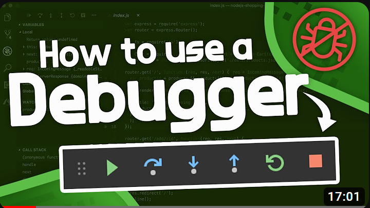

# The VSCode Debugger (0h30)

## How to use the debugger (0h17)



[Link to video](https://youtu.be/7qZBwhSlfOo?si=D19j0n9lwvITiEN2)

This video is a great introduction to the concept of debugging. It explains what a debugger is and how it can help you find bugs in your code.

## Advanced debugging (0h07)


[Link to video](https://youtu.be/2hZ5xwgosso?si=Zj_GhbAKGBaBYgal)

This video shows you how to use some of the more advanced features of the VS Code debugger. Did you know you can change the value of a variable while debugging? Or that you can set breakpoints on specific conditions? This video will show you how to do that.

## Adding additional configurations (0h05)

The videos above all run the debugger on specific files. However, what if the thing you want to debug is a function in a file that is imported by another file? Of if you want to debug the testing suite? In these cases, you will need to add additional configurations.

By clicking on the debug icon on the left, you will open the debug panel. At the top of the panel, you will see a dropdown menu that says `Python File`. Click on it and select `Add Configuration...`. This will open a `launch.json` file. This file contains all the configurations for the debugger. You can add new configurations by adding new objects to the `configurations` array. Here is an example of a configuration that runs the debugger on a specific file `my_file.py`:

```json
{
    "name": "Python: my_file.py",  # The name that will show on the menu
    "type": "python",
    "request": "launch",
    "program": "${workspaceFolder}/my_file.py",
    "console": "integratedTerminal"
}
```

Read [how to set configuration options](https://code.visualstudio.com/docs/python/debugging#_set-configuration-options) to learn more about the different options you can set.

One notable configuration is the `python` option. If VS Code doesn't automatically select the right Python environment for you, then you can also declare an explicitly using it. For example:

```json
{
  "configurations": [
    {
      "name": "Python: Streamlit",
      "type": "python",
      "python": "${workspaceFolder}/venv/bin/python",  # Set this to the path of your Python interpreter
      "request": "launch",
      "module": "streamlit",
      "cwd": "${workspaceFolder}",
      "args": [
          "run", "app.py"
      ],
    }
  ]
}
```
