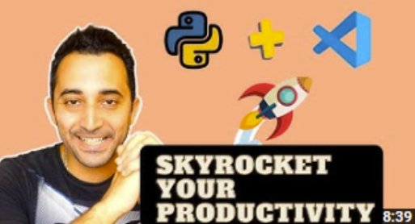

# Text editors

## Get started with Python in VS Code (0:20)

[Link to VS Code docs](https://code.visualstudio.com/docs/python/python-tutorial)

This is the official VS Code tutorial about how to setup VS Code and run/debug a script.

> **You should read this is**: you have never debugged a script/project on an IDE or Text Editor before.

After this lesson you should:

- Know how to select a Python interpreter,
- Know about what comes in the official Python plugin,
- Know how to run the debugger.

## Setting up VS Code for Python development (0:10 + 0:06)

[Link to document](https://docs.google.com/document/u/1/d/1xHJ9Kq9OVsWh4OH8DYB_7dsKW2tzCPZ8FOI9VrGU2SU)

This document helps you setup VS Code's Test Explorer, Tasks. It also provides some plugins recommendations.

[On this video](https://www.youtube.com/watch?v=5eSaJGSGLs0&t=900s) (starting at 15 minutes), Arjan will also help you to setup your VS Code and provides some plugins recommendations. If you are using a Mac, the entire video is worth it. 

## Python Productivity on VS Code (0:08 + 0:17)

  

[Link to video](https://youtu.be/slHzJh6pGo8)

This video shows you tips and shortcuts than can really make your life easier when using VS Code.

[In this video](https://youtu.be/dI34jrEtmB0), once again, our friend Arjan will show you a bunch of useful VS Code keyboard shortcuts to use it like a pro!

After these series of videos, VS Code should have no more secrets for you.

---

## Assignment #3

It's finally time for Assignment #3!

> **Note**: This assignment will require your code to be reviewed by your peers.

This assignment is about creating tests. It's not the more joyful of tasks - particularly for existing code - but it's oh so important.

### Assignment #2 covers

- Creating tests
- Creating test fixtures
- Mocking methods and objects

`cd` into the `assignments` folder, good luck and see you on the other side!
