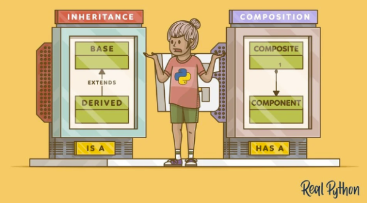

# Design patterns

Design patterns are solutions to common problems in software design.

Design patterns can speed up the development process by providing tested, proven development paradigms. Effective software design requires considering issues that may not become visible until later in the implementation. Reusing design patterns helps to prevent subtle issues that can cause major problems, and it also improves code readability for coders and architects familiar with the patterns.

Design patterns are not tied to any specific programming language. Instead, they are a way of thinking about software design that can be applied to any language.

There are many design patterns, but not all of them are useful for Python.

They can be divided into:

## Creational patterns

Creational design patterns are design patterns that deal with object creation mechanisms. The basic form of object creation could result in design problems or added complexity to the design. Creational design patterns try solve this.

In  this module, the creational patterns we are going to cover is the [`Factory` pattern](#factory-pattern-015).

## Structural patterns

Structural patterns are design patterns that ease the design by identifying a simple way to manage relationships between entities. In this module, the structural patterns we are going to cover is the [`Adapter` pattern](#adapter-pattern-023).

## Behavioral patterns

Behavioral patterns are design patterns that handle common communication patterns between objects. By doing so, these patterns increase flexibility in carrying out this communication. In this module, the behavioral patterns we are going to cover is the [`Strategy` pattern](#strategy-pattern-027) and the [`Command` pattern](#command-pattern-032).

## Inheritance and Composition (0:45)

[Link to RealPython guide](https://realpython.com/inheritance-composition-python/)

Many of these patterns rely on the concept of inheritance and composition. Inheritance is a way to define a new class that is a modified version of an existing class. Composition is a way to define a new class that contains instances of existing classes.

This guide covers the differences and tradeoffs between inheritance and composition and how they can be used to curb complexity. It's a long read, but I assure you it will make you much more comfortable with the concepts of OOP.

## Strategy Pattern (0:27)

[Link to video](https://youtu.be/n2b_Cxh20Fw)

The Strategy pattern is a great way to reduce coupling and separate business rules from code logic.

This video covers the Strategy pattern, but also looks at a few varieties of the pattern using Python features such as Protocol classes, dataclasses, the _call_ dunder method, and closures. The author also answers a lot of questions in the comments.

After this video, you should be able to:

- Apply the pattern using both Protocol and dataclasses

## Adapter Pattern (0:23)

  

[Link to video](https://youtu.be/fsB8_79zI_A)

The Adapter pattern is really useful if you need to connect your application with another system, but you can't change the code of that system and you want to reduce coupling. In this video you'll learn how the pattern works, and then see a functional variant of the pattern using partial application.

## Command Pattern (0:32)

[Link to video](https://youtu.be/FM71_a3txTo)

The Command pattern turns a request into a stand-alone object that contains all information about the request. This transformation lets you pass requests as a method arguments, delay or queue a request's execution, and support undoable operations.

In this video, you'll learn how the Command pattern work by implementing "undo" and "redo" behavior to an application.

## Factory Pattern (0:15)

[Link to video](https://www.youtube.com/watch?v=s_4ZrtQs8Do)

With the (Abstract) Factory pattern, you can separate creation from usage. It allows, for example, to create objects without specifying the exact class of object that will be created. This video explains what the Factory pattern is, and how to use it in Python.

---

## Assignment #5

It's the final assignment! Are you ready? If so, chaaaarge! ╰（‵□′）╯

> **Note**: This assignment will require your code to be reviewed by your peers.

This assignment is about using design patterns to improve your code maintainability.

### Assignment #5 covers

- Design patterns

Open your assignments project, and let's go!

I would wish you good luck, but at this point I know you don't need it. You've got this! And don't forget: the biggest lesson is all this is to always treasure the lovely memories we all made together! (✿◠‿◠)

  
